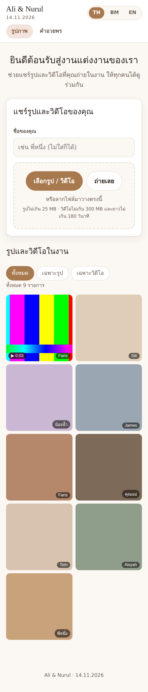
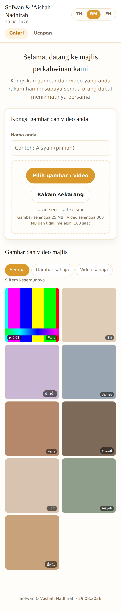
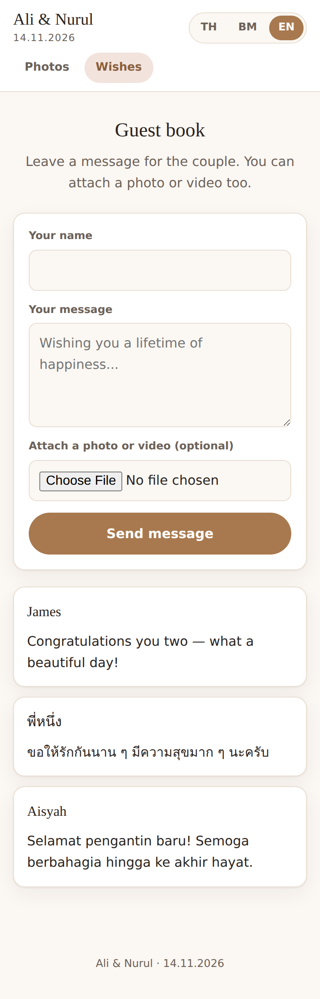

# เว็บแชร์รูปงานแต่ง · Wedding Photo Share

เว็บให้แขกในงานแต่ง **สแกน QR → อัพโหลดรูปและวิดีโอ → ดูของทุกคนร่วมกัน**
รันบน NAS ของคุณเอง ไม่มีค่ารายเดือน ไม่มีลิมิตจำนวนรูป ข้อมูลอยู่กับเจ้าของงาน

รองรับ **4 ภาษาเต็มรูปแบบ — ไทย / Bahasa Melayu / English / العربية** แปลด้วยมือทั้งหมด
ภาษาอาหรับเรียงขวาไปซ้าย (RTL) ทั้งเว็บ การ์ดที่พิมพ์ และหนังที่ export
เว็บเลือกภาษาให้ตามเครื่องของแขกเอง และมีปุ่มสลับอยู่ทุกหน้า

---

## ทำอะไรได้บ้าง

| | |
|---|---|
| 📷 **อัพโหลดโดยไม่ต้องสมัคร** | สแกน QR แล้วส่งได้เลย เลือกหลายไฟล์พร้อมกัน ลากวางได้ มีปุ่มถ่ายรูปสด |
| 🎬 **รองรับวิดีโอ** | .mp4 .mov .m4v .webm — ดึงภาพปกให้อัตโนมัติ และแปลงคลิป HEVC จาก iPhone เป็น H.264 เบื้องหลังเพื่อให้ Android เปิดได้ |
| 📱 **HEIC จาก iPhone** | แปลงเป็น JPEG ให้ทุกเครื่องดูได้ โดยเก็บไฟล์ต้นฉบับไว้ครบ |
| 💌 **สมุดอวยพร** | เขียนคำอวยพรพร้อมแนบรูป/วิดีโอ และไปโผล่บนจอสไลด์โชว์ |
| 🔎 **ค้นหาชื่อแขก** | ดูว่าใครส่งอะไรมาบ้าง ทั้งในหน้าแอดมินและหน้าแกลลอรี่ ชื่อที่พิมพ์ต่างกันนิดหน่อยถือเป็นคนเดียวกัน |
| 📄 **PDF หลังงาน** | สมุดคำอวยพรจัดกลุ่มตามชื่อแขก และรายชื่อผู้ส่งภาพแบบ contact sheet |
| 🎬 **หนังงานแต่ง** | กดครั้งเดียวได้สองเรื่อง (โรงหนัง + กำแพงรูป) ความยาวโปรแกรมคิดเอง พร้อมคลังเพลงสาธารณสมบัติแยกตามงาน |
| 📺 **Slideshow ขึ้นจอ** | รูปที่เพิ่งส่งขึ้นจอภายในไม่กี่วินาที แทรกคำอวยพรและ QR เป็นระยะ |
| 🗂 **ดาวน์โหลดทั้งงาน** | ZIP แยกรูป/วิดีโอ พร้อม `guestbook.txt` แบบ stream ไม่กินแรม |
| 🖨 **การ์ด QR พร้อมพิมพ์** | เลือกได้ 1 / 2 / 4 ใบต่อกระดาษ A4 หนึ่งแผ่น มีคำอธิบายครบ 4 ภาษาในทุกใบ |
| 🎵 **เพลงคลอในหน้าเว็บ** | เลือกจากคลังเพลงชุดเดียวกับที่หนังใช้ · แขกกดเองถึงจะเล่น ไม่ดึงไฟล์เสียงโดยไม่ได้ขอ |
| 🛡 **จัดการหน้างาน** | ลบ/ซ่อนรูปจากมือถือได้ทันที เปิด-ปิดการอัพโหลด และโหมดตรวจก่อนโชว์ |

<p align="center">
  
  
  
</p>

---

## เริ่มใช้งาน

**ติดตั้งบน NAS** → อ่าน [คู่มือบทที่ 1](docs/01-install-nas.md) แบบละเอียด
หรือถ้ารีบ

```bash
git clone <repo> wedding-share && cd wedding-share
sudo ./scripts/deploy-nas.sh --lan   # เตรียมโฟลเดอร์ + .env + build + รัน ให้ครบในคำสั่งเดียว
```

สคริปต์จะสุ่มรหัสแอดมินให้และบอก URL ที่เปิดได้เมื่อเสร็จ
`--lan` เปิดพอร์ตสู่ LAN ไว้ทดสอบจากมือถือก่อน — พอตั้ง reverse proxy เสร็จให้รันซ้ำ
โดยไม่ใส่ `--lan` เพื่อกลับไปผูกเฉพาะ `127.0.0.1` (ค่ามาตรฐาน บังคับให้ผ่าน TLS)
เพิ่ม `--dry-run` เพื่อดูก่อนว่าจะทำอะไรบ้าง หรือ `--port 18091` ถ้าพอร์ตชนกับแอปอื่น

เปิด `http://ไอพีของ-nas:18090` แล้วเข้า `/admin` เพื่อพิมพ์การ์ด QR

**รันบนเครื่องตัวเองเพื่อลองเล่น**

```bash
npm install
ADMIN_PASSWORD=changeme123 npm start        # http://localhost:3000
```

## คู่มือฉบับเต็ม (ภาษาไทย)

1. [ติดตั้งบน NAS](docs/01-install-nas.md) — shared folder, PUID/PGID, docker compose
2. [DDNS + Reverse Proxy + HTTPS](docs/02-ddns-reverse-proxy.md) — **รวมการแก้ลิมิตอัพโหลดของ nginx ที่พลาดกันบ่อยที่สุด**
3. [ตั้งค่างานและพิมพ์การ์ด QR](docs/03-qr-cards.md)
4. [ต่อจอ Slideshow ในงาน](docs/04-slideshow.md)
5. [ดาวน์โหลดและสำรองข้อมูล](docs/05-download-backup.md)
6. [เช็คลิสต์วันงาน](docs/06-checklist.md) — พิมพ์แผ่นนี้ติดตัวไว้
7. [ติดตั้งบน Shafiq-NAS (as-built)](docs/07-shafiq-nas.md) — ค่าจริงของ infra ชุดนั้น: `wedding.shafiq-lap.com`, AdGuard + Cloudflare, wildcard cert, MikroTik NAT และวิธีส่งโค้ดขึ้น NAS ที่ไม่มี git

## การตั้งค่า

ทุกอย่างอยู่ในไฟล์ `.env` — ดูรายการเต็มพร้อมคำอธิบายที่ [`.env.example`](.env.example)
ค่าที่ใช้บ่อย

| ตัวแปร | ค่าเริ่มต้น | ความหมาย |
|---|---|---|
| `ADMIN_PASSWORD` | — | **ต้องตั้ง** อย่างน้อย 8 ตัวอักษร |
| `BASE_URL` | — | ที่อยู่ที่ฝังใน QR code ต้องเป็น https |
| `COUPLE_NAMES` / `EVENT_DATE` | — | ชื่อและวันที่บนหัวเว็บและการ์ด |
| `DEFAULT_LANGUAGE` | `th` | ภาษาสำรองเมื่อเดาจากเครื่องแขกไม่ได้ |
| `MAX_IMAGE_MB` | `25` | ขนาดรูปสูงสุดต่อไฟล์ |
| `MAX_VIDEO_MB` | `300` | ขนาดวิดีโอสูงสุดต่อไฟล์ |
| `MAX_VIDEO_SECONDS` | `180` | ความยาวคลิปสูงสุด |
| `CONVERT_VIDEOS` | `true` | แปลง HEVC/mov เป็น mp4 H.264 เบื้องหลัง |
| `REQUIRE_REVIEW` | `false` | ให้เจ้าภาพอนุมัติรูปก่อนขึ้นแสดง |
| `UPLOAD_WINDOW` | ว่าง | เปิดรับเฉพาะช่วงเวลาที่กำหนด |
| `SLIDESHOW_SECONDS` | `8` | วินาทีต่อสไลด์ |

## โครงสร้างข้อมูลบน NAS

```
/volume1/wedding/
├── uploads/    ไฟล์ต้นฉบับทั้งหมด          ← ต้อง backup
├── derived/    รูปย่อ ภาพปก วิดีโอที่แปลงแล้ว  ← สร้างใหม่ได้
├── db/         SQLite (ชื่อผู้ส่ง คำอวยพร)   ← ต้อง backup
└── tmp/        ไฟล์ระหว่างอัพโหลด
```

ไฟล์ต้นฉบับวางเป็นไฟล์ธรรมดาในโฟลเดอร์จริง เปิดผ่าน File Station หรือ SMB
ได้ตลอด และให้ Synology Photos ไล่ index ได้ — ไม่ถูกล็อกอยู่ในระบบของแอปนี้

## เทคโนโลยีที่ใช้

Node.js 22 + Express · SQLite (better-sqlite3) · sharp · ffmpeg · EJS + vanilla JS
คอนเทนเนอร์เดียว ไม่มีฐานข้อมูลแยก ไม่มี build step ฝั่ง frontend
กินแรมประมาณ 150–250 MB ตอนใช้งานปกติ

## การทดสอบ

```bash
npm test
```

ครอบคลุม 38 เคส: คีย์ภาษาครบทั้ง 3 ไฟล์และไม่มีคำแปลตกหล่น, ตรวจชนิดไฟล์จาก
magic bytes (รวมไฟล์ปลอมนามสกุล), อัพโหลดรูปและวิดีโอจริงตั้งแต่ต้นจนจบ,
การแปลง HEVC → H.264, การปฏิเสธคลิปยาวเกินพร้อมข้อความในภาษาที่ถูกต้อง,
สิทธิ์เข้าหน้า admin, การสร้าง ZIP และ rate limit

## ความปลอดภัย

- ตรวจชนิดไฟล์จาก magic bytes ไม่เชื่อนามสกุลที่ผู้ใช้ส่งมา
- ตั้งชื่อไฟล์ใหม่แบบสุ่มเสมอ ไม่นำชื่อจากผู้ใช้ไปใช้เป็น path
- จำกัดขนาดไฟล์ จำนวนไฟล์ต่อครั้ง และพื้นที่รวม
- rate limit แยกกันระหว่างการอัพโหลด คำอวยพร และการล็อกอิน
- เซสชันแอดมินเป็น token สุ่มเก็บใน httpOnly cookie เทียบรหัสผ่านแบบ timing-safe
- คอนเทนเนอร์รันด้วยผู้ใช้ที่ไม่ใช่ root

## License

MIT
